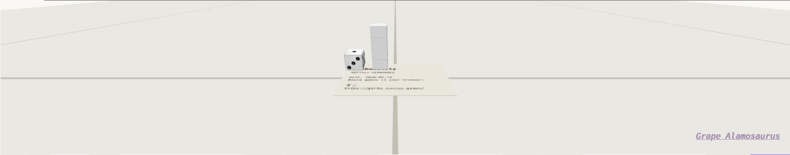
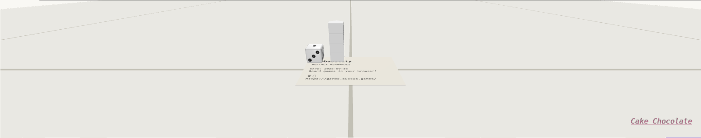

# Root anisotropy review and performance pass

Reviewed on 2026-09-16 against Royal 0.0.30 (`981b64b3`) for release 0.0.31.

## Review

Review found and fixed a pre-existing context-restoration defect: released
ImageBitmap references remained in canonical materials while replacement decode
was pending. Invalidating GPU residency now publishes every affected texture
key so materials discard those references before the first restored draw. Both
the asset-owner notification test and root upload-order regression fail before
the fix and pass after it. The real-browser trace originally caught GL error
1281 from `texSubImage2D`; deployment was paused until this was corrected.

Checked the immutable
root/React option, capability capping and unsupported-extension fallback,
ordinary and overlay sampler ownership, lazy VT propagation, atlas migration,
context restoration, nearest filtering, directional page demand, and retained
residency budgets. The previous SVG LOD bias is absent.

Setting hardware anisotropy on the VT atlas alone would not fix the virtual LOD
selection and could filter across unrelated physical slots. The manual bounded
taps and matching CPU demand are justified by this storage layout. Each tap
resolves its own page; explicit atlas LOD preserves mixed MIN/MAG selection.
The review added a persistent real-WebGL regression to CI because shader-source
assertions alone do not verify the new filtering. The renderer archive budget
also needed an explicit 4,608-byte allowance for code, declarations and maps;
the anisotropy archive measured 876,140 bytes, and the final restoration fix
also passes the 876,416-byte ceiling.

The new browser regression checks directional stripe detail and every pixel
across repeated page boundaries, plus mixed nearest/linear minification and
magnification. The existing BLEND regression passes all 150 pixels. The full
suite passes 1,573 tests across 157 files and the 65-case glTF manifest. Typecheck,
strict lint, build, package entrypoints, packed TypeScript 6/7 consumers/codecs,
and bundle limits pass. Onboarding also recovers from a lost WebGL context with
both ordinary and virtual anisotropy enabled, with no GL or page errors.

## Performance method

`benchmark.cjs` runs against Probability's literal root `pnpm dev`, started with
`ROYAL_DEV_PATH` pointing at this rebuilt checkout. It requires the sibling
Probability checkout and its Playwright dependency. Override `PROBABILITY_DIR`
and `PROBABILITY_URL` if necessary. It uses fresh browser contexts in the order
1, 4, 16, 16, 4, 1, and overrides only the root's default option for the controls.
The actual hardware sampler and VT uniform values are checked.

Each run uses a 1920×1080 viewport at DPR 1, the onboarding Play iframe, the
business-card camera at distance 0.16, and pitches 0.5 and 0.12 radians. It waits
for residency, makes a small deterministic yaw sweep, discards 40 warmup steps,
and records 80 presented frames per view. Hot reload is disabled only in the
measurement browser to isolate the run from ongoing workspace edits.

CPU time surrounds the renderer's callback on the **parent window's** frame
clock. Synchronized wall time adds a 1×1 `readPixels` to wait for queued GL work.
This includes software GPU execution, command transport and readback overhead;
it is neither GPU timer-query time nor ordinary animation FPS. Measurements
use Chromium/ANGLE SwiftShader on this host, not physical Safari or Quest.
No builds or other test suites ran during the recorded final pass. These
steady-rendering traces precede the final restoration-only notification fix.

The per-frame samples, snapshots and renderer string are in `performance.json`.
The before/after images show the same card at 1× and 16×:

## Results

Ranges below are the medians from the two fresh-context runs. Synchronized
wall time includes forced readback and must not be interpreted as live FPS.

| Pitch | Anisotropy | CPU median (ms) | Synchronized median (ms) | Desired pages |
| --- | --- | --- | --- | --- |
| 0.5 | 1× | 0.8–1.5 | 32.4–51.4 | 8 |
| 0.5 | 4× | 0.9–1.6 | 41.4–75.8 | 20 |
| 0.5 | 16× | 1.0–1.1 | 40.6–41.5 | 20 |
| 0.12 | 1× | 0.6–0.8 | 18.8–26.7 | 4 |
| 0.12 | 4× | 0.9–1.0 | 22.8–23.5 | 8 |
| 0.12 | 16× | 1.0–1.1 | 26.0–28.7 | 20 |

The two viewing angles explain the compromise: at 0.5 radians, 4× already
covers the footprint and requests the same 20 pages as 16×; at 0.12 radians,
4× caps detail sooner and requests eight pages versus twenty at 16×. The 1×
control requests eight and four pages respectively. Retained atlas allocation
across the traces is about 0.53–0.65 MiB at 1× and 1.18–2.19 MiB at 4×/16×,
within the unchanged 256 MiB root budget.

The second 4× normal-angle run contains 94 recorded frames rather than 80;
the second 1× run contains 88. Both coincide with additional idle ASTC
publication and atlas migration (recorded in the snapshots), and their timing
ranges are substantially wider. Those runs remain in the report. This limits
any exact throughput comparison: the data demonstrates the residency tradeoff,
but does not establish a physical-device frame-time guarantee or a stable
percentage slowdown. No performance-motivated code change was justified by
these noisy software-GPU measurements. The requested default stays 16; 4 is
available to consumers that prefer a lower directional-detail ceiling.
